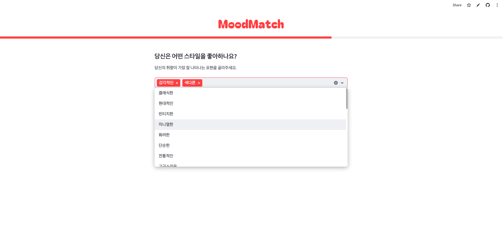
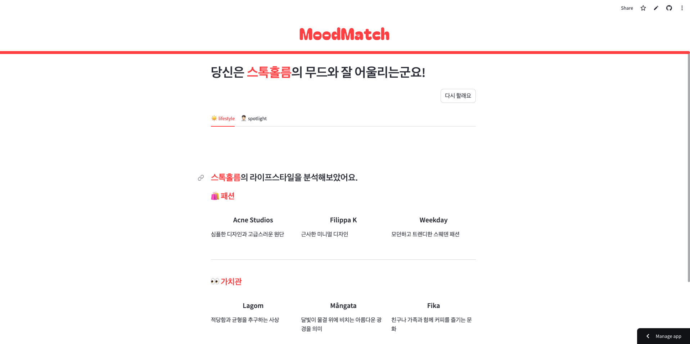

<h1 align="center">
 
</h1>
MoodMatch is an AI-driven curation service that helps users find the most suitable city and matching style for them.
 
 

- Deployment URL: https://moodmatch.streamlit.app/
- Development Period: June 20, 2024 ~ June 23, 2024 (Personal Project)
   
   

## Tech Stack

Python, Streamlit, OpenAI API

## Key Features

Multi-keyword selection, AI prompting based on input information, curated style recommendations processed from AI responses

## 🌏 Languages

- [한국어 버전(Korean)](./README.ko.md)
- [English Version](./README.md)
